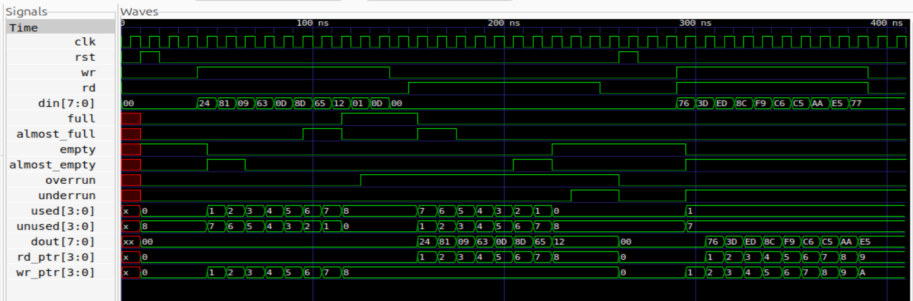
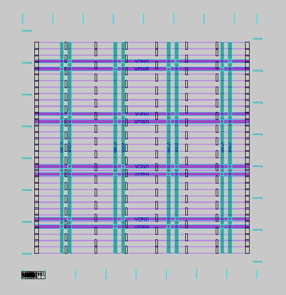
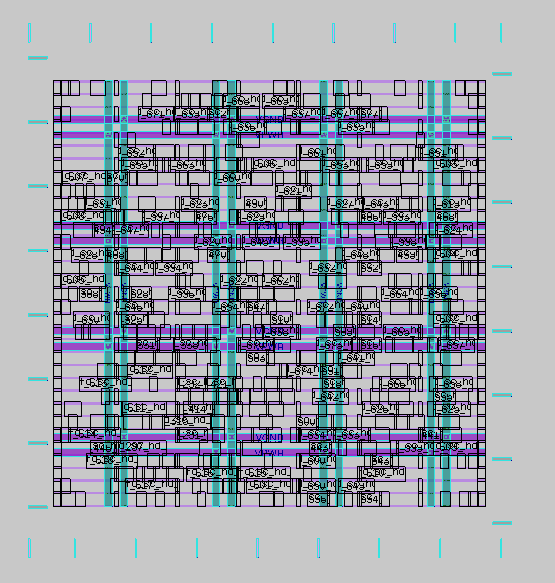
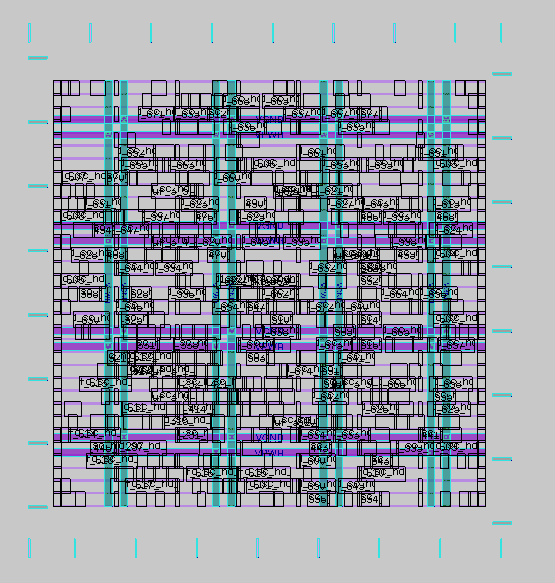
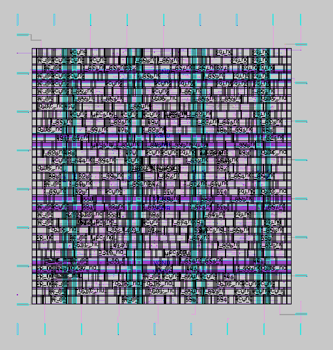
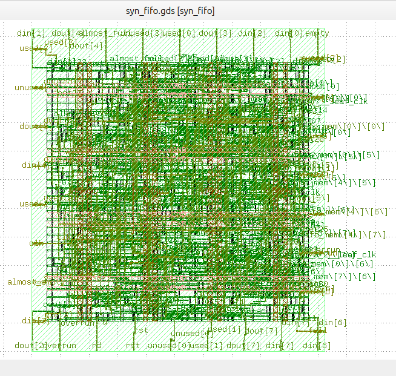
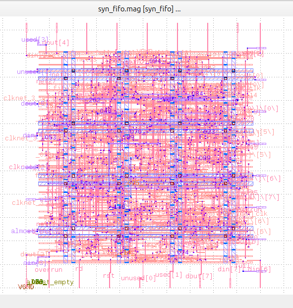
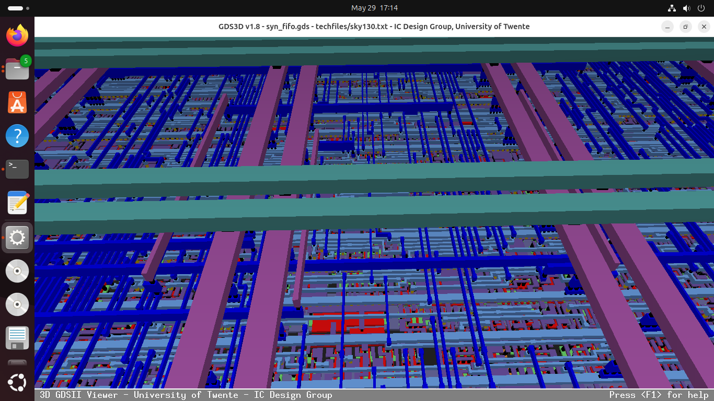
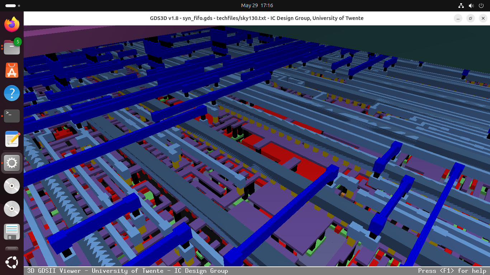
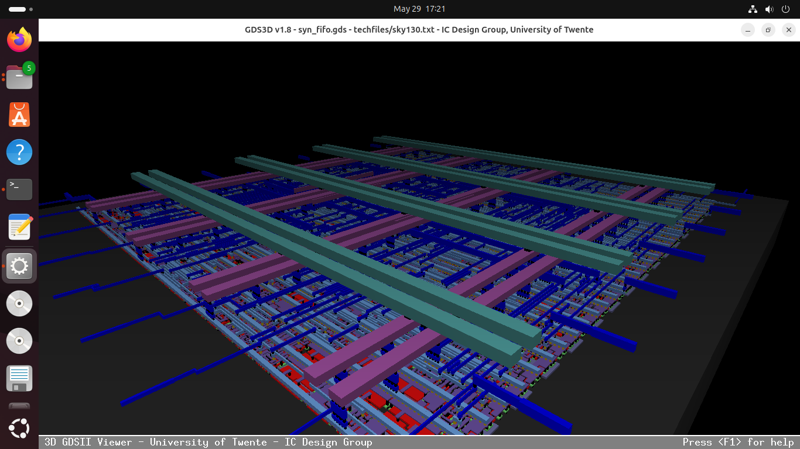

# RTL to GDS Implementation of Synchronous FIFO (First In First Out) with Opensource Tools
---
# Overview

This project demonstrates the complete RTL-to-GDSII implementation flow of a parameterized synchronous FIFO using open-source ASIC design tools and the Sky130 PDK.

The project covers RTL design, functional verification, coverage analysis, logic synthesis, schematic visualization, and physical design flow leading to final GDSII generation.

The FIFO was designed in Verilog HDL and verified using simulation-based testing methodologies. The design was then synthesized using Sky130 standard cells and implemented through the OpenLane physical design flow.

This repository showcases the end-to-end ASIC implementation process of a digital design block, along with reports, layouts, waveforms, and intermediate results generated throughout the flow.

---
# Tools Used

| Tool           | Purpose                                 |
| -------------- | --------------------------------------- |
| Icarus Verilog | RTL Simulation                          |
| GTKWave        | Waveform Visualization                  |
| Covered        | Code Coverage Analysis                  |
| Yosys          | Logic Synthesis & Schematic Generation  |
| OpenLane       | RTL to GDSII Physical Design Flow       |
| Magic          | Layout Visualization & DRC Checking     |
| KLayout        | GDSII Visualization & XOR Verification  |
| GDS3D          | 3D Visualization of Final GDS Layout    |
| Sky130 PDK     | Standard Cell Library & Open-Source PDK |

---
# Design Specification

The design implements a parameterized synchronous FIFO (First-In First-Out) memory buffer in Verilog HDL. The FIFO operates using a single clock domain for both read and write operations.

## Features

* Parameterized data width and FIFO depth
* Single-clock synchronous operation
* Full and empty status indication
* Almost full and almost empty detection
* Overflow and underflow indication
* Occupancy (`used`) and available space (`unused`) tracking

## Parameters

| Parameter | Default | Description |
|-----------|---------|-------------|
| `depth_pow` | 3 | Depth of FIFO = 2^depth_pow (default: 8 locations) |
| `width` | 8 | Data width in bits |
| `threshold` | 2 | Threshold for almost_full / almost_empty flags |

## Supported Operations

* Write operation when FIFO is not full
* Read operation when FIFO is not empty
* Simultaneous read and write operations
* Pointer wrap-around handling


## Module Ports

| Port | Direction | Width | Description |
|------|-----------|-------|-------------|
| `clk` | Input | 1 | System clock, active rising edge |
| `rst` | Input | 1 | Asynchronous active-high reset |
| `wr` | Input | 1 | Write enable |
| `rd` | Input | 1 | Read enable |
| `din` | Input | width | Data input |
| `dout` | Output | width | Data output |
| `full` | Output | 1 | FIFO full flag |
| `empty` | Output | 1 | FIFO empty flag |
| `almost_full` | Output | 1 | Asserts when unused slots ≤ threshold |
| `almost_empty` | Output | 1 | Asserts when used slots ≤ threshold |
| `used` | Output | depth_pow+1 | Number of occupied locations |
| `unused` | Output | depth_pow+1 | Number of free locations |
| `overrun` | Output | 1 | Sticky flag — write attempted when full |
| `underrun` | Output | 1 | Sticky flag — read attempted when empty |

## Internal Architecture

- **Memory** — `fifo_mem` : array of `2^depth_pow` registers, each `width` bits wide
- **Pointers** — `wr_ptr` and `rd_ptr` are `depth_pow+1` bits wide (extra MSB used for full/empty distinction)
- **Full detection** — lower bits of both pointers match but MSBs differ
- **Empty detection** — both pointers are identical
- **Overrun/Underrun** — sticky flags, set on illegal access, cleared only on reset

---
# RTL Simulation

RTL simulation was performed to verify the functional correctness of the [FIFO Design](Design%20Files/syn_FIFO.v) with a [Testbench](Design%20Files/syn_FIFO_tb.v) involving different operating conditions using **Icarus Verilog** and **GTKWave**.

The testbench was developed to validate:

* Reset operation
* Sequential write operations
* Sequential read operations
* Simultaneous read and write operations
* FIFO full and empty boundary conditions
* Pointer wrap-around behavior

Randomized input data was applied during simulation to observe FIFO behavior under dynamic conditions, with the following commands.

```
iverilog -o sim syn_fifo.v syn_fifo_tb.v
vvp sim
gtkwave waveform.vcd
```

## Waveform Analysis

The generated waveforms were analyzed in GTKWave to verify:

* Correct data flow through the FIFO
* Proper assertion or deassertion of status flags
* Correct occupancy tracking
* Read/write synchronization behavior



---
# Code Coverage Analysis

Code coverage analysis was performed using the **Covered** tool to evaluate the effectiveness of the RTL verification process and ensure that important design behaviors were exercised during simulation.

The generated [Coverage report](Results/syn_fifo_cov.txt) confirm that the testbench successfully validated functional scenarios of the synchronous FIFO design.

### Coverage Results

| Coverage Type                | Result |
| ---------------------------- | ------ |
| Line Coverage                | 100%   |
| Toggle Coverage              | 100%   |
| Combinational Logic Coverage | 92%    |

### Coverage Observations

* All major FIFO operations were exercised successfully
* Full and empty boundary conditions were covered
* Simultaneous read/write conditions were verified
* Pointer wrap-around behavior was validated
* Status flag generation logic was tested extensively

The slightly lower combinational logic coverage is attributed to certain internal logic combinations that are difficult to activate under FIFO operating conditions.

The detailed [Coverage report](Results/syn_fifo_cov.txt) can be generated by the following commands, 

```
covered score -t syn_fifo -i syn_fifo_tb.fifo -v syn_fifo.v -vcd waveform.vcd -o fifo.cdd
covered report coverage.cdd
```

---
# Physical Design Flow

After RTL verification and schematic visualization, the design was taken through the complete RTL-to-GDSII physical design flow using the OpenLane framework with the Sky130 HD standard cell library.

The OpenLane flow was used to automate various ASIC implementation stages including synthesis, floorplanning, placement, clock tree synthesis (CTS), routing, timing analysis, and final layout generation.

Each stage of the flow was analyzed using generated reports and layout visualizations to study the physical implementation characteristics of the synchronous FIFO design.

The following sections present the individual stages of the physical design flow along with corresponding outputs, reports, and layout snapshots.

```
make mount
./flow.tcl -design syn_fifo
```

---
## Synthesis

In this step, the RTL code is translated into a gate-level netlist using the standard cells from the Sky130 PDK.
The synthesis process optimizes the design for area, timing, and power, preparing it for the subsequent physical design steps.

The tool performs RTL synthesis using OpenLane’s integrated Yosys tool. It maps the Verilog design to Sky130 standard cells, generates the [gate-level netlist](Results/Synthesis/syn_fifo_net.v), and produces reports for timing and area analysis.
The Gate Level Schematic of the design obtained through Yosys after synthesis with SKY130 is as follows:


---
## Floorplan

Floorplanning defines the physical layout of the design on the chip.
It sets the core area, I/O placement, and guides the placement and routing tools to optimize area and timing.
This step is critical for achieving a balanced design with good utilization and minimal congestion.

The images below, captured from Magic, show the layout after floorplanning:



---
## Placement

Placement determines the exact positions of all standard cells within the core area defined during floorplanning.
A good placement ensures minimal wire length, reduced congestion, and better timing, which is essential for an efficient and manufacturable design.

The images below, captured from Magic, show the placement of standard cells within the core area:



---
## Clock Tree Synthesis

Clock Tree Synthesis (CTS) ensures that the clock signal reaches all sequential elements (flip-flops) with minimal skew and latency.
A balanced clock tree is critical for correct timing and synchronization across the entire chip.

The images below, captured from Magic, includes the clock tree:



---
## Routing

Routing connects all standard cells and macros according to the netlist and placement, creating physical connections (metal layers) between gates.
A well-optimized routing ensures minimal congestion, correct signal connectivity, and meets timing requirements.

The images below, captured from Magic, show the routed design:



---
## Layout Visualization

After physical design, the layout can be visualized before post-layout verification.
OpenLane integrates tools like Magic and KLayout to view the design at the GDSII level and compare layouts.

Visualization in Magic:


Visualization in Klayout:




Visualization in GDS3D:





---
## Signoff

After layout generation, the design undergoes post-layout verification to ensure that the physical implementation matches the RTL and meets manufacturing rules.
These checks are critical for functional correctness, design rule compliance, and manufacturability.

The following snippets highlight the final signoff status obtained from OpenLane reports and logs.

```
Total XOR differences = 0
```
```
Design Name: syn_fifo
Run Directory: /openlane/designs/syn_fifo/runs/RUN_2026.05.28_12.22.34
----------------------------------------

Magic DRC Summary:
Source: /openlane/designs/syn_fifo/runs/RUN_2026.05.28_12.22.34/reports/signoff/drc.rpt
Total Magic DRC violations is 0
----------------------------------------

LVS Summary:
Source: /openlane/designs/syn_fifo/runs/RUN_2026.05.28_12.22.34/logs/signoff/39-syn_fifo.lef.lvs.log
Number of nets: 517                        |Number of nets: 517                        
Design is LVS clean.
----------------------------------------

Antenna Summary:
Source: /openlane/designs/syn_fifo/runs/RUN_2026.05.28_12.22.34/logs/signoff/41-arc.log
Pin violations: 0
Net violations: 0
```

---
# Final Reports

The `Reports` directory contains the key summary reports generated at various stages of the OpenLane flow. These cover synthesis statistics, static timing analysis at multiple stages, power estimation, and physical design signoff including DRC, LVS, and antenna checks.
All reports are in their original format as generated by OpenLane and OpenROAD. Refer to the respective report files for detailed breakdowns.

**Reports Summary:**

The final reports indicate that the design completed the RTL-to-GDS flow successfully, with all critical checks passing and no major violations reported. These reports mark the completion of the design implementation process.

| Category | Metric | Value |
|----------|--------|-------|
| **Design** | Design Name | syn_fifo |
| | Standard Cell Library | sky130_fd_sc_hd |
| | Synthesized Cell Count | 385 cells |
| | Flow Status | Completed |
| **Runtime** | Total Runtime | 5 min 24 sec |
| | Routing Runtime | 4 min 30 sec |
| **Area & Utilization** | Die Area | 0.01157 mm² |
| | Core Area | 8175.34 µm² |
| | Final Core Utilization | 50% |
| **Timing** | Worst Negative Slack (WNS) | 0.0 ns |
| | Total Negative Slack (TNS) | 0.0 ns |
| | Critical Path Delay | 2.81 ns |
| | Suggested Clock Frequency | 100 MHz |
| **DRC** | Magic DRC Violations | 0 |
| **LVS** | Total LVS Errors | 0 |
| **Antenna** | Pin Antenna Violations | 0 |
| | Net Antenna Violations | 0 |
| **Routing Quality** | Short Violations | 0 |
| | Metal Spacing Violations | 0 |
| | Off-Grid Violations | 0 |
| **GDS Check** | KLayout GDS XOR Violations | 0 |

Detailed implementation metrics are available in the [metrics.csv](Reports/metrics.csv) file.

---
# Conclusion

Final GDS: [GDSII](Results/Final/syn_fifo.gds)

This project successfully demonstrates the complete RTL-to-GDSII implementation flow of a parameterized synchronous FIFO using open-source ASIC design tools and the Sky130 PDK.

The design was functionally verified through RTL simulation and coverage analysis, followed by Sky130 standard-cell mapping and full physical design implementation using the OpenLane flow. Various intermediate stages including synthesis, floorplanning, placement, clock tree synthesis, routing, timing analysis, and final GDSII generation were analyzed using generated reports and layout visualizations.

Through this project, practical understanding was gained in digital design, verification methodologies, logic synthesis, ASIC physical design flow, timing analysis, and standard-cell based implementation techniques.

The project serves as a complete end-to-end demonstration of modern open-source ASIC design methodology for a digital hardware block.


